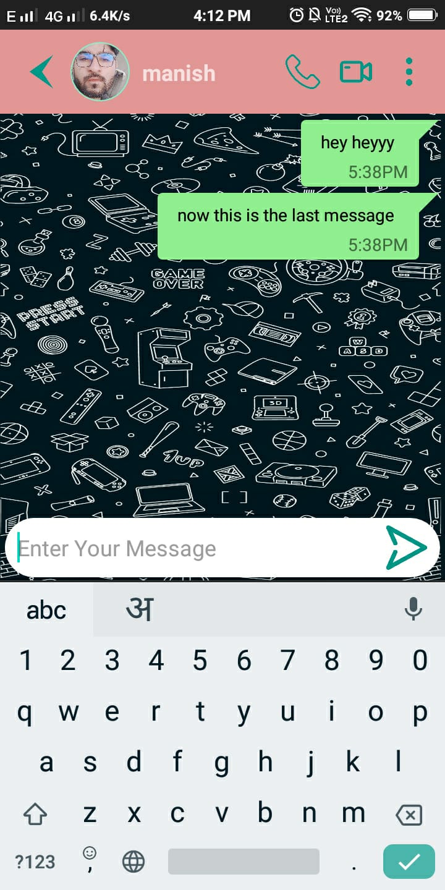

# Chat_Chat_Android_App
> SPLASH SCREEN ANIMATION ....

  

<table>
  <tr>
    <td>Login</td>
     <td>Registration</td>
     <td>Chat Home</td>
  </tr>
  <tr>
    <td></td>
    <td></td>
    <td></td>
  </tr>
 </table>
 
 <table>
  <tr>
    <td>Menu</td>
     <td>Chat Inside 1</td>
     <td>Chat Inside 2</td>
  </tr>
  <tr>
    <td></td>
    <td></td>
    <td></td>
  </tr>
 </table>
 
 <table>
  <tr>
    <td>Receiver Chat</td>
     <td>Different User</td>
     <td>Last Message</td>
  </tr>
  <tr>
    <td></td>
    <td></td>
    <td></td>
  </tr>
 </table>
 
 > User Profile Before
 

  

 > User Profile After
 

  

